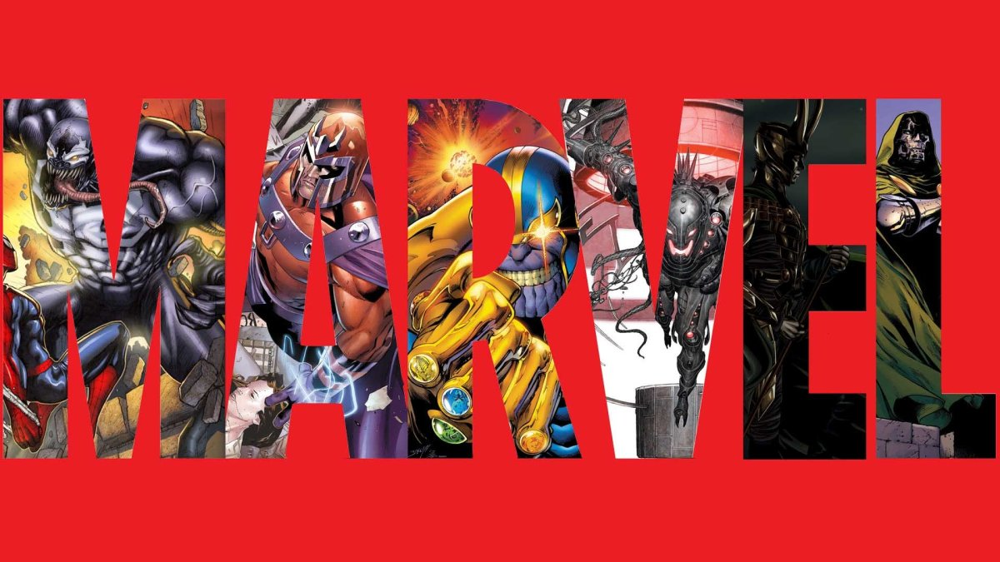

link para usar o app https://marvel-front-stone.herokuapp.com/login

### A aplicação

Aplicação para fazer buscas de quadrinhos e personagens da Marvel.

Esta possui:
- página para cadastro de novo usuário.
- página de login.
- página para alteração dos dados do usuário.
- página para encontrar um quadrinho.
- página para encontrar um personagem.
- página para visualizar os quadrinhos favoritos.
- página para visualizar os personagens favoritos.
- página para visualizar os detalhes de um determinado quadrinho.
- página para visualizar os detalhes de um determinado quadrinho.

### Lançamentos Principais

Arquitetura:
- back-end: Rest,
- front-end: SOLID

Back-end:
- Criado no node com sequelize.
- Bando de Dados MySQL nas nuvens.
- Senha criptografada com hash salt usando o bcrypt.
- Token gerado com JWT.

Front-end:
- Criado no JavaScript com o Reat.
- API feita de (https://developer.marvel.com/).
- compartilhamento de dados com o context.
- CSS responsivo em toda a aplicação.
- validação se o password possui mais de 6 caracteres.
- Validação se o e-mail possui um formato valido.

### Créditos
- projeto crido por Luís Ferrari
- e-mail: luisdiasferrari@gmail.com
- linkdin: https://www.linkedin.com/in/luisdferrari/
