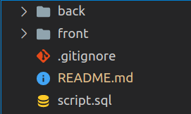

### Estrutura de pastas


### Como executar

Entre na **pasta do back** e instale as dependências
```
npm install
```

Entre na **pasta do front** e instale as dependências
```
npm install
```

Entre na **pasta do back** e criar um arquivo .env
```
//na raiz do back
toutch .env
```

nciara o código dentro do arquivo .env
```
HOSTNAME=localhost
MYSQL_USER=root
MYSQL_PASSWORD= (INSIRA O PASSWORD DO SEU MYSQL)
SCHEMA=Marvel
```

Crie o banco de dados usando o sequelize
```
//na raiz do back
sequelize db:create
npx sequelize db:migrate
```

Suba seu **servidor de back** (ele roda na porta **3001**)
```
//na raiz do back
npm start
```

Suba seu **servidor de front** (ele roda na porta **3000**)
```
//na raiz do front
npm start
```
